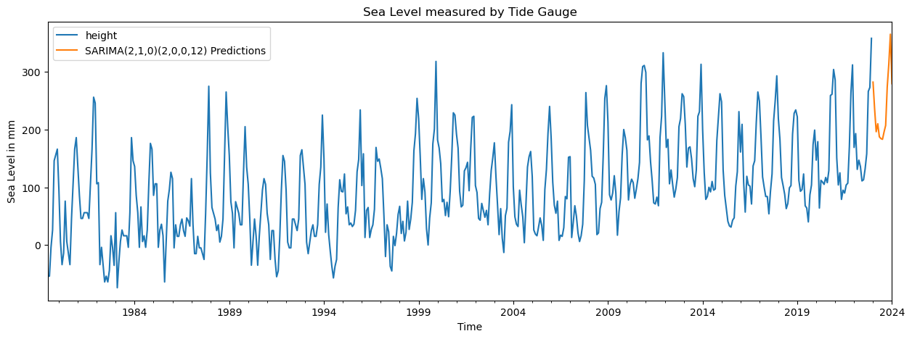

# sealevel-tidegauge-singapore
Mean Sea Level Prediction with Time Series Model for Singapore

Climate change is an urgent global issue that affects ecosystems, communities, and economies. This is evident from shifts in temperature, changes in precipitation patterns, and rising sea levels, all of which underscore the need for immediate understanding and action.

This project aims to explore the impact of global warming on Singapore's climate evidence from the change in rate of sea level rising trend. Several hypothesis testing conducted on monthly Mean Sea Level Tide Gauge Data collected by the Permanent Service for Mean Sea Level (PSMSL). And a time series forecast model built based on past observations, and used in predicting near future trend. 

## Objectives: 

1. To identify trends and seasonal patterns, 
2. To determine the significance of changes in sea level conditions with statistical hypothesis testing for trending 
3. To build a time series model (SARIMA) based on past observations and predict near future trend, with underlying seasonality preserved.

## Table of Contents:
1. Retrieve Sea Level Tide Gauge Datasets directly from PSMSL website
2. Imputation for missing values in Time Series Data
3. Linear Regression plots for each Tide-gauge Station
4. Comparison of Mean Sea Level with .resample() between Monthly and Yearly Mean
5. Comparison of Mean Sea Level with varying Rolling Mean
6. Questions:
- What was the percentage increase in the mean value from the first year of measurement to the last year?
- In which year was the annual mean height the lowest since the start of measurements?
- In which years were the annual mean heights among the bottom 10 lowest since the start of measurements?
- Which 10 months had the highest annual mean heights since the start of measurements?
7. Comparion of Mean Sea Level with Simple Moving Averages (SMA) with Exponentially Weighted Moving Average (EWMA)
8. Using Statsmodels for conducting statistical tests, and EDA
9. Descriptive Statistics and Tests
- Tests for Stationarity
    - Augmented Dickey-Fuller Test
    - Kwiatkowski-Phillips-Schmidt-Shin
    - Philips-Perron Test
- Test for Trend
    - Mann-Kendall Test
10. Forecasting procedure
- ARIMA(p,d,q) forecasting model
11. Two main ways to choose these ARIMA(p,d,q) terms:
- Classical Method: 
    - AutoCorrelation Function (ACF)
    - Partial AutoCorrelation Function (PACF)
- Grid Search Method
12. SARIMA vs ARIMA models
13. Evaluate the Model
14. Conclusion
15. Reference

## Conclusion

### Findings from tide-gauge stations Mean Sea Level (MSL) Dataset 

1. **Linear regression model**: **`-1.00 mm/year ~ +6.88 mm/year`** for different location, may not be suitable for Sea Level Rise modeling, to fully capture the trend due to seasonality, and cyclical nature of Sea Level Rise data.
2. **Mann-Kendall trend test**: **`50% of MSL`** measured are with **`upward trend`**, and **`remaining shows no trend`**
3. **ADF test**: **`>70% of MSL`** are **`not stationary`**
4. **KPSS test**: **`35% of MSL`** measured are **`not stationary`**
5. **PP test**: **`7% of MSL`** measured are **`not stationary`**
6. **Tide-gauges measurement accuracy/precision** are technology dependent, with large variance in the estimating MSL.
7. **SARIMA(p,d,q)(P,D,Q)[m]** model with extra parameters (P,D,Q) for the **seasonal components** better than **ARIMA(p,d,q)**, with best AIC Information Criterion, **SARIMA(2,1,0)(2,0,0,12)** model as best-fit for the time series Mean Sea Level data with lower RMSE Error
8. **Mean Sea Level Rising** also dependent on more complex geophysical driving mechanisms of climate change (which are outside the scope of this project) including:
    - radiative forcing 
    - greenhouse gas emission and concentration futures
    - ice-sheet processes, such as MICI (Marine Ice Cliff Instability)

## Reference:

1. "**Mapping Sea-Level Change in Time, Space, and Probability**", Dr Benjamin P. Horton et al. Annu. Rev. Environ. Resour. 2018. 43:481–521, 2018 https://www.annualreviews.org/doi/pdf/10.1146/annurev-environ-102017-025826

2. "**Changes in extreme high water levels based on a quasi‐global tide‐gauge data set**", Menéndez - 2010 - Journal of Geophysical Research: Oceans - Wiley Online Library

3. "**Deglacial perspectives of future sea level for Singapore**", Shaw, T.A., Li, T., Ng, T. et al. Commun Earth Environ 4, 204 (2023). https://doi.org/10.1038/s43247-023-00868-5 

4. "**Tide Gauge Data**", Permanent Service for Mean Sea Level (PSMSL), Retrieved 31 Jul 2023 from http://www.psmsl.org/data/obtaining/

5. "**New Data Systems and Products at the Permanent Service for Mean Sea Level**". Simon J. Holgate, Andrew Matthews et. al. (2013) Journal of Coastal Research: Volume 29, Issue 3: pp. 493 – 504. doi:10.2112/JCOASTRES-D-12-00175.1.

6. "**Climate Science, Risk & Solutions (Climate Knowledge for Everyone)**", Dr. Kerry Emanuel, Atmospheric Science, MIT https://climateprimer.mit.edu/climate-science-risk-solutions.pdf

7. "**Sea level trend and variability in the Singapore Strait**", Tkalich, P., Vethamony, P., Luu, Q.-H., and Babu, M. T. , Ocean Sci., 9, 293–300, https://doi.org/10.5194/os-9-293-2013, 2013

## To create the environment from the .yml file, use the command:

conda env create -f environment.yml

## After creating the environment, activate it with:

conda activate timeseries_sealevel

## Then, start Jupyter notebook with:

jupyter notebook

## To export a raw data file in .csv with selected Station ID

python helpers.py

### To deactivate the active environment, use

conda deactivate

